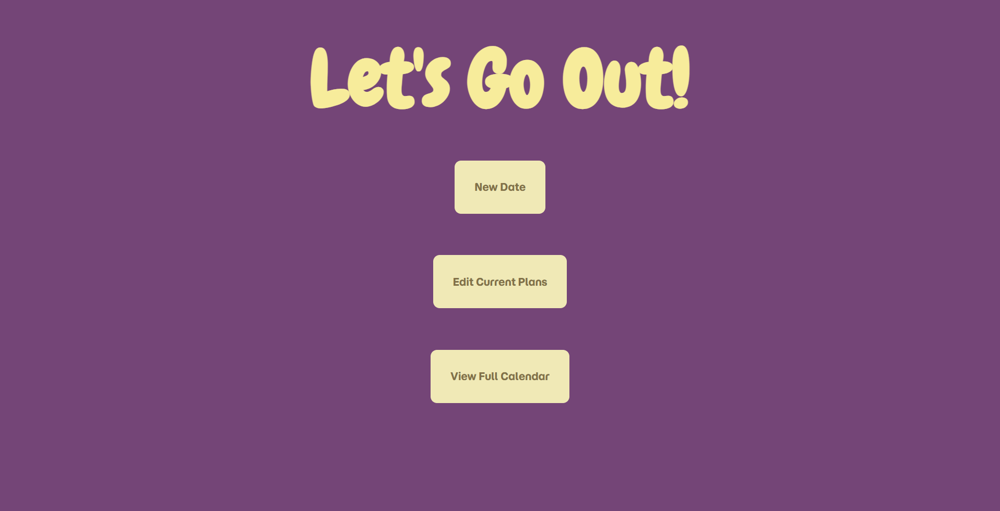
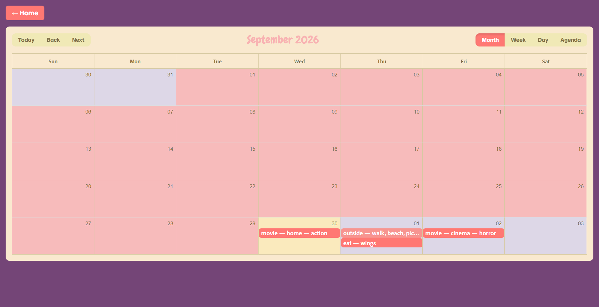

# OurCalendar

A date-planning app for couples: schedule a date through a cascading question wizard (what to do → sub-options → when), view everything on a shared calendar, and edit or cancel plans as they change. This was a little fun weekend project I did after my Girlfriend jokingly mentioned me doing something we could "write our future dates" on.

**Live demo:** _https://our-calendar-app.vercel.app/_




---

## Features

- **Cascading question wizard** instead of a flat form, pick an activity (Eat / Go outside / Watch a movie), then branch into activity-specific sub-options, then pick a day and hour.
- **Multi-select sub-options** for activities that support combos (e.g. "Go outside" → Beach + Picnic in one appointment).
- **Conflict-checked scheduling** — appointments can share a day, but not a start time. Enforced both client-side (UX) and server-side (source of truth, returns `409` on conflict).
- **Calendar + list views** — a full month/week/day/agenda calendar (via `react-big-calendar`), plus a list view for editing/deleting.
- **Click-to-expand event details** — clicking an event on the calendar opens a card with the full appointment info, including an optional note.
- **Full edit support, including changing the activity type** — e.g. an "Eat" date can be edited into a "Watch a movie" date, with an optional note explaining the change (e.g. "money's tight this week").
- **Email notifications** on every create and edit, via Resend.
- **Rate limiting** on write endpoints via Upstash Redis, to protect against abuse on a publicly-open API.

---

## Tech Stack

| Layer | Choice |
|---|---|
| Framework | Next.js (App Router), TypeScript |
| Database | MongoDB Atlas, native driver (no Mongoose) |
| Calendar UI | react-big-calendar + date-fns |
| Email | Resend |
| Rate limiting | Upstash Redis + `@upstash/ratelimit` |
| Hosting | Vercel |

---

## Architecture

This is a **single Next.js application** — no separate Express backend. The API lives inside `src/app/api/` as Next.js Route Handlers, sharing the same deployment as the frontend.

```
Browser (React) --fetch--> Next.js Route Handlers --queries--> MongoDB Atlas
                                     |
                                     └--> Resend (email on create/edit)
                                     └--> Upstash Redis (rate limiting)
```

Key files:

- `questionFlow.ts` — a typed, config-driven question tree. Each question maps to a `next` question key; `activityRouting` handles the one case where routing depends on the *answer* (which activity was picked) rather than a fixed next step.
- `AppointmentWizard.tsx` — a single component driving both the "New Date" (create) and "Edit Plans" (edit) flows, parameterized by a `mode` prop. Avoids duplicating the cascading-question logic across two components.
- `app/api/appointments/route.ts` — list + create, with the scheduling-conflict check and email/rate-limit hooks.
- `app/api/appointments/[id]/route.ts` — edit + delete, including logic to `$unset` stale fields when an appointment's activity type changes.

---

## Key Design Decisions

- **Config-driven question flow.** Adding a new activity type or sub-question is a matter of editing `questionFlow.ts`, not rewriting component logic.
- **One wizard, two modes.** Rather than building a separate edit form, `AppointmentWizard` is reused for both creation and editing — editing simply pre-fills `initialAnswers` and starts back at the first question, which naturally supports changing the activity type entirely.
- **Conflict rule enforced twice.** Same-day-different-time appointments are allowed; same start time is not. This is checked client-side for immediate feedback and server-side as the actual source of truth, since client checks can be bypassed.
- **No authentication, by design.** This is a portfolio sample, kept intentionally open so anyone can try the live demo without an account. The trade-off (open write access) is mitigated with rate limiting rather than closed off with a login wall.

---

## Bugs Found & Fixed

Documenting these because the debugging process is more useful to show than the finished feature list.

### 1. Dynamic route `[id]` returning 404
**Symptom:** `PUT /api/appointments/<id>` returned a generic 404, not a JSON error — meaning the route wasn't matching at all.
**Cause:** Next.js 15+ changed dynamic route `params` from a plain object to a `Promise`. The route handler's signature (`{ params }: { params: { id: string } }`) no longer matched what the framework was passing in, so the handler silently failed to register.
**Fix:** Updated the signature to `{ params }: { params: Promise<{ id: string }> }` and added `const { id } = await params;` before use.

### 2. Optimistic delete masking a backend failure
**Symptom:** Deleting an appointment appeared to work (it vanished from the list), but it was still present in Atlas and still showed up on the calendar.
**Cause:** The delete handler removed the item from local React state *unconditionally*, without checking whether the `fetch` call actually succeeded — so it was hiding the 404 from bug #1 rather than surfacing it.
**Fix:** Wrapped the delete in a `try/catch`, checked `res.ok` before updating local state, and surfaced a user-facing error on failure.

### 3. Stale fields left behind when changing activity type
**Symptom:** Editing an "Eat" appointment into a "Watch a movie" appointment left the old `eatChoice` field sitting in the MongoDB document alongside the new `movieGenre`/`movieLocation` fields.
**Cause:** MongoDB's `$set` only touches fields present in the update payload — it doesn't remove fields that aren't mentioned.
**Fix:** The `PUT` route now computes which activity-specific fields *aren't* part of the incoming payload and explicitly `$unset`s them.

### 4. Clearing an optional field didn't persist
**Symptom:** Clearing the "note" field while editing an appointment had no effect — the old note stayed in the database.
**Cause:** The client was sending `note: undefined` when the field was cleared, but `JSON.stringify` drops `undefined` values entirely — so the `note` key never reached the server at all, meaning there was nothing for `$set` to act on.
**Fix:** Changed the client to always send `note` explicitly (as an empty string when cleared), and had the server treat an empty string as "unset this field" rather than storing an empty value.

---

## Known Limitations 

- **No authentication** — intentional for this portfolio sample, but a real deployment for personal use would add a shared-secret or login gate.
- **Fixed 1-hour event duration** — appointments don't currently store an end time; the calendar assumes a flat 1-hour block per event.
- **Serverless Mongo connections** — the native driver's connection is cached per function instance, which works well for this project's scale, but a high-traffic production app would want a more robust connection-pooling strategy (e.g. MongoDB's serverless-optimized settings, or a dedicated connection proxy).
- **No automated tests yet** 

---

## Running Locally

```bash
git clone <your-repo-url>
cd ourcalendar
npm install
```

Create a `.env.local` with:

```
MONGODB_URI=your_mongodb_atlas_connection_string
RESEND_API_KEY=your_resend_api_key
NOTIFY_EMAIL=email_to_notify_on_changes
UPSTASH_REDIS_REST_URL=your_upstash_redis_url
UPSTASH_REDIS_REST_TOKEN=your_upstash_redis_token
```

```bash
npm run dev
```

The app runs at `http://localhost:3000`.
